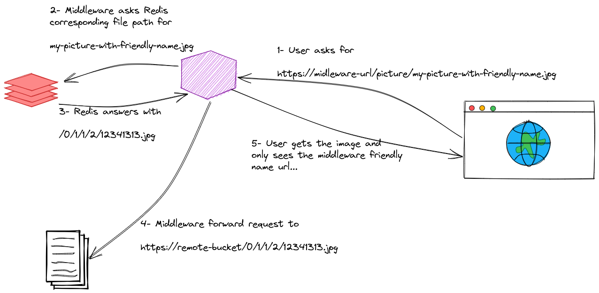

# Simple files reverse proxy middleware

The goal of this project is to propose a middleware allowing to forward file calls on a public or private bucket while doing file renaming. This is a POC which aims to demonstrate the technical feasibility.

> This project was developed in Go for a performance matter (speed and resource consumption)

## Principle

This application works as a reverse proxy that forwards requests to a corresponding file on a remote file storage (bucket). Redis is used to provide a filename translation, enabling the possibility to use friendly names for files:



> ⚠️ Redis must be fed by an external tool ⚠️

## Installation

You need to have docker and docker-compose on your computer to make it work. Simply run:

```bash
docker-compose build
docker-compose up -d

# Import redis map examples
cat redis-import.txt | docker-compose exec -T redis redis-cli --pipe
```

This runs:

- A redis instance without password
- The middleware application listening on port 6060
- A caddy server that serves static files from the `pictures` folder listening on port 2015

Now, you can try to click on:

- __Simple local renaming:__ http://localhost:6060/picture/beautiful-lag-guitar.png serves the file `pictures/0987523723009832.png` from [local Caddy server](http://localhost:2015/0987523723009832.png)
- __Complex local tree and renaming:__ http://localhost:6060/picture/gopher.webp serves the file `pictures/0/1/sub/17/original-0c2e27a535ca15358be82cb68805de49.webp` from [local Caddy server](http://localhost:2015/0/1/sub/17/original-0c2e27a535ca15358be82cb68805de49.webp)
- __Simple remote renaming and forwarding:__ http://localhost:6060/picture/really-cute-kitten-800x600.jpg serves an external picture from the website [placekitten.com](https://placekitten.com/800/600)

## Performance

Performance test is made using [Cassowary](https://github.com/rogerwelin/cassowary). Load a test with 100 concurrent users and 10000 requests for a redis database with 3365 keys.

| Server                     | Average server processing |
|----------------------------|---------------------------|
| Caddy (direct file access) | __4.65ms__                |
| Middleware                 | __8.9ms__                 |


<details><summary>Caddy details</summary>

```bash
➜ cassowary run -u http://localhost:2015 -c 100 -n 10000 -f caddy-urls.txt

Starting Load Test with 10000 requests using 100 concurrent users

 100% |████████████████████████████████████████| [0s:0s]            610.347277ms


 TCP Connect.....................: Avg/mean=2.88ms 	Median=0.00ms	p(95)=30.00ms
 Server Processing...............: Avg/mean=4.65ms 	Median=3.00ms	p(95)=11.00ms
 Content Transfer................: Avg/mean=0.17ms 	Median=0.00ms	p(95)=1.00ms

Summary:
 Total Req.......................: 10000
 Failed Req......................: 0
 DNS Lookup......................: 3.00ms
 Req/s...........................: 16384.12
```

</details>

<details><summary>Middleware details</summary>

```bash
➜ cassowary run -u http://localhost:6060 -c 100 -n 10000 -f middleware-urls.txt

Starting Load Test with 10000 requests using 100 concurrent users

 100% |████████████████████████████████████████| [1s:0s]            1.009647695s


 TCP Connect.....................: Avg/mean=2.04ms 	Median=0.00ms	p(95)=24.00ms
 Server Processing...............: Avg/mean=8.90ms 	Median=7.00ms	p(95)=18.00ms
 Content Transfer................: Avg/mean=0.12ms 	Median=0.00ms	p(95)=1.00ms

Summary:
 Total Req.......................: 10000
 Failed Req......................: 2
 DNS Lookup......................: 1.00ms
 Req/s...........................: 9904.44
```

</details>

## SWOT

### Strengths

- It works great
- Easy to deploy
- Very light codebase
- Very low resource need (image: 29.5MB / memory: 1.5MB)
- Low query overhead (4ms)

### Weakness

- Adds 2 new SPOF to Bricoman application: If middleware or redis is down, no images are served...
- Adds 2 new layers to manage
- Redis and Bricoman DB must be synchronized

### Opportunities

- Take advantage to rename 3P pictures with friendly names
- If Arbol prefers to set authentication on their bucket, it is possible
- Can have very simple urls with tree (`/0/1/3/4/132437.jpg`...)
- Redis could be fed by a cloud function on file modification on the bucket
- Easy google cloud run deployment

[](https://deploy.cloud.run)

### Threats

- ?
